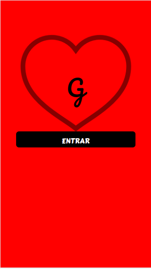
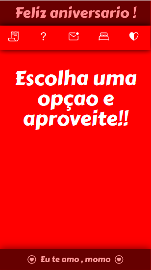
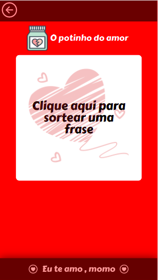
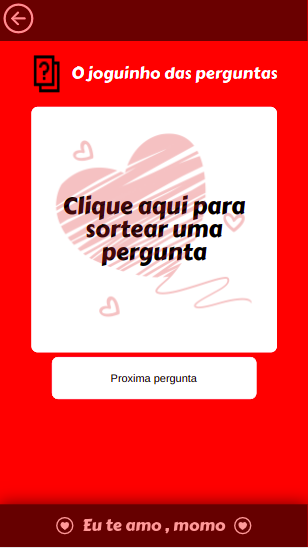
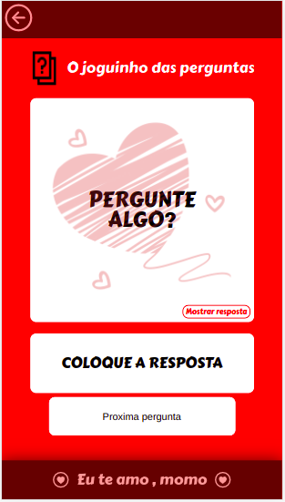
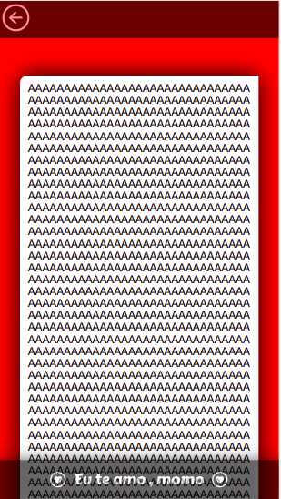
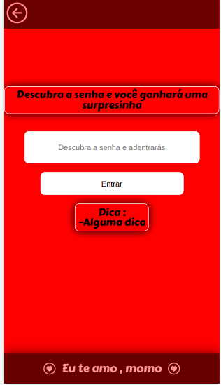
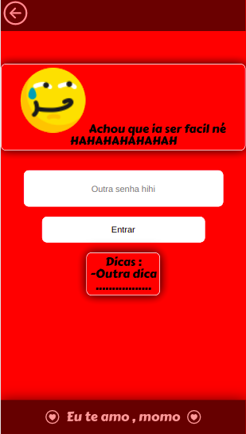
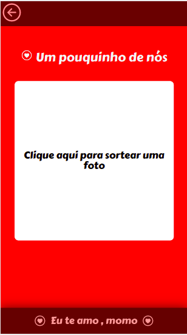

<h1>Happy Birthday </h1>
<h3>This project was made as a birthday present for my boyfriend.
In it , you can put pictures , phrases , and leave a written letter</h3>

<h6>This project was realized with react js</h6>

  
  
  
  
  
  
  
  
  

# HappyBirthday
# HappyBirthday
# HappyBirthday
